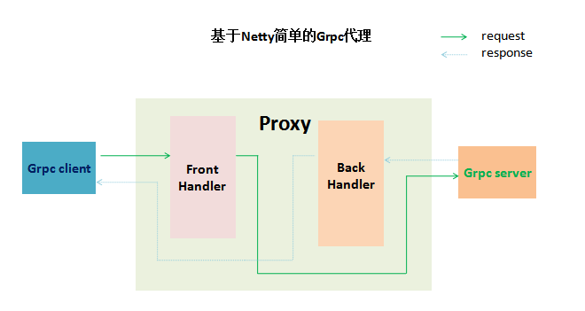
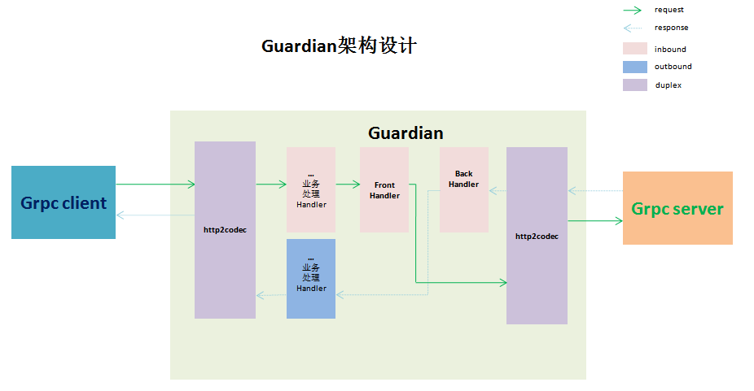

# 背景
APP后端重构采用了框架，test框架采用了google最近开源的高性能rpc框架grpc,用etcd作为注册中心，实现服务自动的注册与发现。由于test框架不够完善，目前遇到几个痛点：
- gateway需要业务人员重新编写代码实现；
- 无法实现一些高级的服务治理功能：服务路由、过载保护、灰度发布、服务降级等功能；

# 需求
基于以上痛点，我们想设计一个真正意义的API gateway，API gateway不但是系统的唯一入口，同时，负责服务请求路由、组合及协议转换。客户端的所有请求都首先经过API网关，
然后由它将请求路由到合适的微服务。同时它可能还具有其它职责，如身份验证、监控、负载均衡、缓存、“请求整形（request shaping）”与管理、静态响应处理

# guardian实现基础——基于netty的Grpc代理

基于netty的Grpc代理架构如下图。guardian的实现灵感来自于Netty的一个最简单的代理转发实现。

如上图，简单的Grpc代理的实现原理是先建立两个通道：Grpc client与代理的channel、Grpc server与代理的channel。
并在Grpc client与代理的channel的ChannelPipeLine中添加一个inbound类型的ChannelHandler(Front Handler),
当Front Handler收到client的请求时，直接把请求写入Grpc server与代理的channel，这样Grpc server就可以收到client端的请求。同样，在Grpc server与代理的channel的
ChannelPipeLine中添加一个inbound类型的ChannelHandler（Back Handler），Back Handler会把Grpc server的回复直接写入Grpc client与代理的channel。这样实现grpc的代理转发。
# 架构

guardian的架构下图

如上图,为了便于在Grpc代理中添加我们自己的业务处理（比如：路由选择、限流等），我们需要对http2的帧进行解析，所以我们在Grpc client与guardian、Grpc server与guardian之间
添加一个Http2FrameCodec,它是一个双向的handler,当客户端的请求到达时，添加一个Http2FrameCodec会自动把请求信息解析为http2帧。反之，Http2FrameCodec会自动把http2帧编码成
字节码传个Grpc Server。我们可以在Http2FrameCodec后面添加若干个inbound handler、outbound handler，
由这些handler实现自定义的业务处理。

# 模块设计

基础模块
  - config: 配置模块，解析配置文件，获取整个guardian项目的配置（已实现）；
  - core: 核心模块，主要是实现代理转化、负载均衡等核心功能（已实现）；
  - starter: 负责加载guardian项目各个子模块，启动guardian服务（已实现）；
业务模块
  - ssl: ssl模块，用于ssl加密传输（已实现）；
  - http2: 负责与grpc client端的连接、http2帧编解码等功能（已实现）；
  - http: 负责与http2降级为http1的client交互；
  - router：负责服务路由、数据路由等功能；
  

